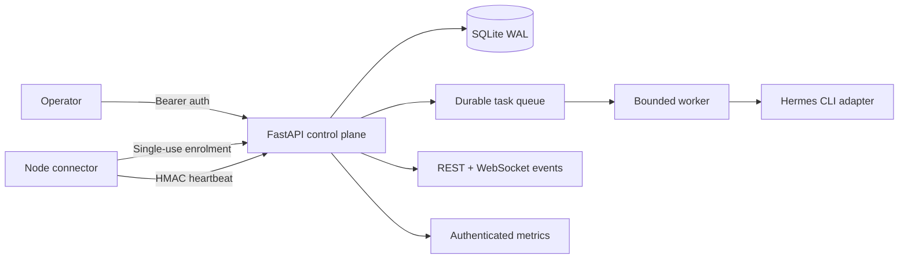

# Hermes Fleet Control

Secure, local-first control plane for a distributed Hermes Agent network.

It provides durable task dispatch, authenticated node enrolment, event replay, observability and independent workers without making individual Hermes nodes depend on the control plane for local operation.

## Verified status

- **16 tests passing** across security, migrations, adapters, service files and orchestration
- SQLite WAL integrity checks and schema-versioned migrations
- production startup refusal for default enrolment/operator secrets
- single-use enrolment and per-node HMAC-signed heartbeats
- backend-confirmed fleet dashboard, REST event replay and authenticated WebSocket stream

## Implemented foundation

- FastAPI control plane with typed Pydantic boundaries
- durable SQLite task queue with idempotency keys
- bounded independent worker execution
- versioned Hermes CLI adapter using `hermes --profile NAME -z PROMPT`
- correlation IDs, authenticated metrics and replayable events
- capability merge semantics and local node connector
- independent hardened systemd user services for API, worker and connector
- five validated typed orchestration templates

## Architecture



## Install

```bash
python3 -m venv .venv
.venv/bin/pip install -e '.[dev]'
.venv/bin/pytest -q
```

## Production configuration

Create secrets locally; never commit the generated environment file:

```bash
mkdir -p ~/.config/hermes-fleet-control
umask 077
cat > ~/.config/hermes-fleet-control/env <<EOF
HFC_ENVIRONMENT=production
HFC_DATABASE_PATH=$PWD/data/fleet.db
HFC_ENROLLMENT_SECRET=$(openssl rand -hex 32)
HFC_OPERATOR_TOKEN=$(openssl rand -hex 32)
HFC_HERMES_BINARY=$HOME/.local/bin/hermes
HFC_BASE_URL=http://127.0.0.1:8876
HFC_NODE_STATE=$PWD/data/local-node.json
HFC_HEARTBEAT_SECONDS=30
EOF
chmod 600 ~/.config/hermes-fleet-control/env
```

## Launch

```bash
mkdir -p ~/.config/systemd/user
cp deploy/systemd/hermes-fleet-{api,worker,node}.service ~/.config/systemd/user/
systemctl --user daemon-reload
systemctl --user enable --now \
  hermes-fleet-api.service \
  hermes-fleet-worker.service \
  hermes-fleet-node.service
curl -fsS http://127.0.0.1:8876/healthz
```

Endpoints:

- API: `http://127.0.0.1:8876`
- OpenAPI: `http://127.0.0.1:8876/docs`
- dashboard: `http://127.0.0.1:8876/ui`

## Dispatch semantics

Task creation confirms durable queueing only. A client must poll or consume the event stream until the worker records a terminal state.

```bash
curl -fsS -X POST http://127.0.0.1:8876/api/v1/tasks \
  -H "Authorization: Bearer $HFC_OPERATOR_TOKEN" \
  -H 'content-type: application/json' \
  -H "Idempotency-Key: manual-$(date +%s%N)" \
  -d '{"node_id":"NODE_ID","profile":"default","prompt":"Return only: FLEET_OK"}'
```

## Operations

See [`docs/OPERATIONS.md`](docs/OPERATIONS.md) for enrolment, dispatch, event streaming, metrics, backup, upgrade, rollback and service removal.

Project state and Hermes state remain separate backups and separate failure domains.

## Honest limitations

- Remote HTTPS enrolment requires a separately secured network path such as an approved Tailscale Serve configuration.
- Shared HMAC node credentials are mode-`0600`, but are not yet replaced by mTLS.
- Typed workflow templates exist; persistent multi-step workflow-run scheduling is not yet wired to the task queue.
- SQLite fits the current fleet scale; PostgreSQL has not been added without measured need.
- OIDC and multi-user RBAC are not claimed. Current operator access uses one strong bearer token.

## Licence

MIT.
